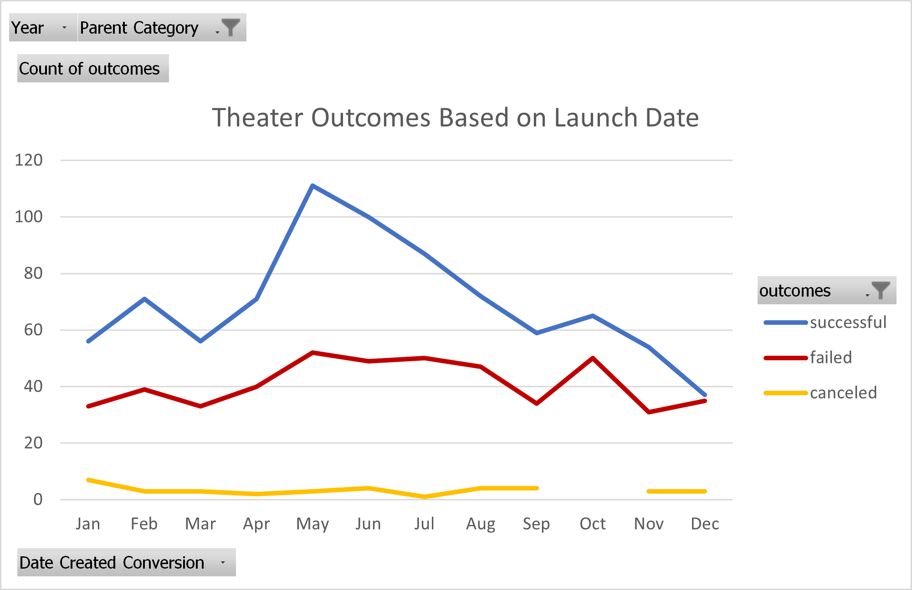
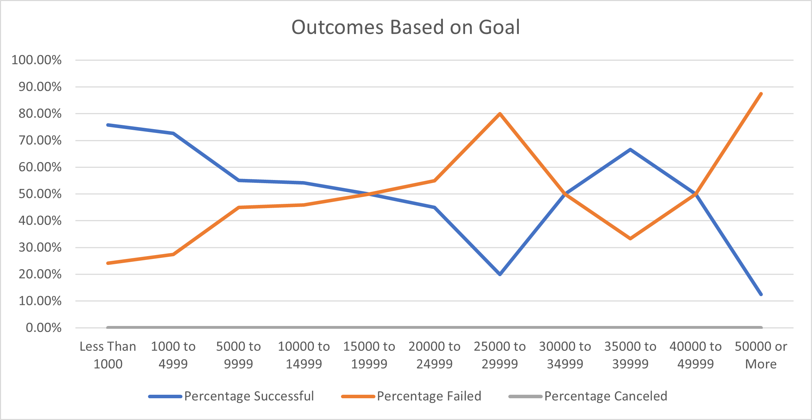

# Kickstarting with Excel

## Overview of Project
Louise is a playwright looking to start a crowdfunding campaign to fund her play *Fever*. She would like to analyze a large dataset of crowdfunding data in order to gain insight into what is takes to create a successful campaign.

### Purpose
Using the data, Louise wants to specifically look into how well theater crowdfunding campaigns did with respect to launch date and how well crowdfunding campaigns for plays did with respect to their fundraising goals.

## Analysis and Challenges
The analysis was performed in Excel using the built-in functionalities of pivot tables and other spreadsheet capabilities. 

The raw data and analysis can be found here [Kickstarter Analysis](https://github.com/RexBas90/kickstarter-analysis).

### Analysis of Outcomes Based on Launch Date
To analyze how campaigns did in relation to launch date, the year each campaign started was extracted from the exact launch date that was provided in the data. Then a pivot table was created with months in the rows and outcomes in the columns and added filters for Year and Parent Category. The pivot table was enhanced by putting the order of the columns in the following order: successful, failed, and then canceled. After filtering the Parent Category by Theater, a line chart was created to better visualize the relationship between launch date and number of campaigns for each of the three outcomes (successful, failed, and canceled.)

### Analysis of Outcomes Based on Goals
To analyze how campaigns did in relation to fundraising goals, the necessary data for plays was extracted from the data set provided. It was then sorted into one of 12 categories (less than $1000, $1000 to $4,999, $5,000 to $9,999, $10,000 to $14,999, $15,000 to $19,999, $20,000 to $24,999, $25,000 to $29,999, $30,000 to $34,999, $35,000 to $39,999, $40,000 to $44,999, $45,000 to $49,999, and $50,000 or more) for each of the three types of outcomes (successful, failed, canceled). The total number of projects in each category was determined in order to calculate the percentage of success, failed, and canceled fundraisers. A line chart was created to better visualize the relationship between fundraising goal and the three types of outcomes. 

### Challenges and Difficulties Encountered

Some of the difficulties that could be encountered is if the raw data was not (for the most part) in a usuable format. Steps were taken to convert the launch date prior to this so the year could easily be extracted. 

## Results

- What are two conclusions you can draw about the Outcomes based on Launch Date?

1) The trend lines for Failed and Canceled campaigns are relatively flat as compared to Successful campaigns. Launch date seems to impact the success of the campaign but it does not appear that it is a good indicator as to whether or not the campaign will fail.

2) Many campaigns that are launched in early summer (i.e. May) appear to have a higher chance of being successful.

- What can you conclude about the Outcomes based on Goals?

The success of the campaign trends downwards as the fundraising goal increases. However, for this particular data set, it starts to become more variable for campaigns with goals of $25,000 or higher.  

- What are some limitations of this dataset?

There are not many data points for campaigns that have a fundraising goal of $25,000 or more. This is evident on the Outcomes versus Goals chart since the trend line becomes more variable over $25,000. There are on average only 8 data points in the last 6 categories as compared to around 198 data points for the first 6 categories. This means the data is not as conclusive for the larger fundraising goal campaigns. 

- What are some other possible tables and/or graphs that we could create?

With regards to Outcomes versus Launch date, it would be advisable to also add a filter for country to see if this trend is the same across the theater industry worldwide or if there are variances specific to certain countries.

With regards to Outcomes versus Goals, it would be useful to create a boxplot to gain a better measure of spread of the data points. From the chart created, it is not easy to see how many data points are in each category. Proving a boxplot in conjunction with the line chart would show that most of the data points exist for low goals amounts as opposed to the larger goal amounts. 